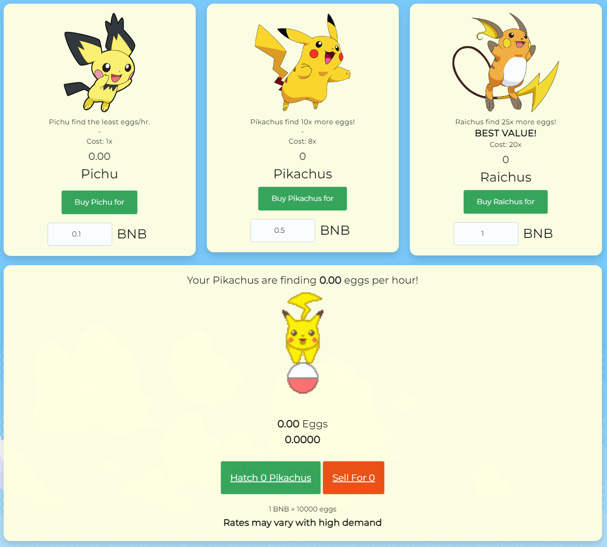

# Pikachu.Finance

## [Check our smart contracts on bscscan](https://bscscan.com/address/0x805c5019c5120ee1c6148a935ba95777fd64413b#code) 

## The purpose of the game is to collect Pikachu eggs to grow your Pikachu family or choose to sell the eggs for BNB!

### Earn BNB farming Pikachu Eggs!
Pikachu Egg Farm is a farming simulator and idle game on the blockchain.
The more Pikachus you have, the more eggs they find (each Pikachu finds at a rate of 1 egg per day).
Hatch more Pikachus with your eggs to multiply your production, or cash them out for BNB!

### Automated Market
Pikachu Egg Farm features a high tech automated market that lets you instantly buy Pikachu or sell Pikachu Eggs. Driven by supply and demand, the price automatically adjusts as players trade.

### Referrals
Earn **10%** the number of all eggs used by anyone who starts playing using your link: http://PikachuEgg.Finance/?ref={Your_Address}
